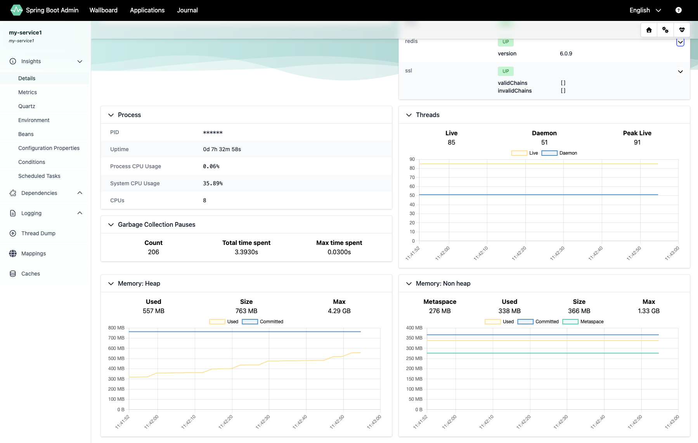
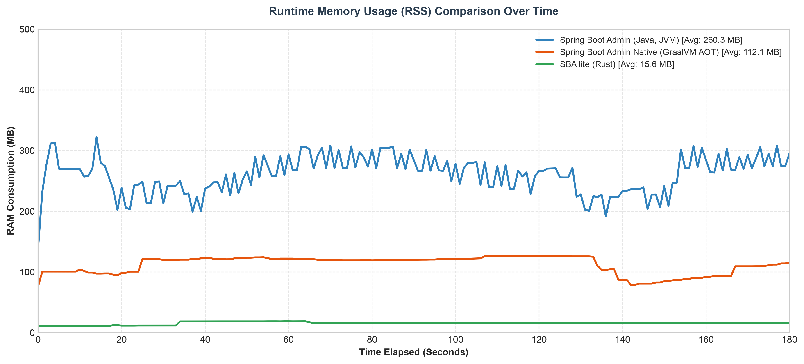
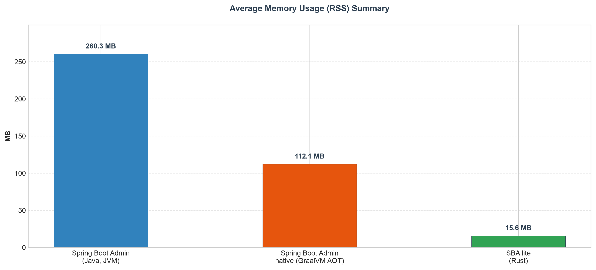

# SBA Lite

Lightweight, JVM-free monitoring server designed specifically for **Spring Boot applications** exposing **Actuator** endpoints.

SBA Lite embeds the official Spring Boot Admin Vue UI into a native Rust backend. Rather than acting as a simple network proxy, the Rust core provides an active **payload translation layer**: it intercepts, parses, and reformats remote Spring Boot Actuator responses in real time to match the exact data structures expected by the frontend Vue UI.<p >

</p>

## Features

- **Embedded UI**: The official Spring Boot Admin Vue UI is compiled directly into the single executable binary, requiring no external asset deployment.
- **Lightweight Backend**: Zero-JVM, low-overhead monitoring powered by a native Rust core using ~15 MB of memory.
- **Actuator Adaptation & Translation**: Actively intercepts and translates remote Spring Boot Actuator payloads to seamlessly match the expected data structures of the UI.
- **State & Discovery**: Application and instance discovery with continuous health polling and an event journal.
- **Real-time Updates**: Live instance state updates driven by Server-Sent Events (SSE).

## Memory Footprint & Runtime Behavior

Observed Resident Set Size (RSS) in the author's environment over a 180-second idle monitoring cycle:

| Implementation | Average Memory (RSS) | Memory Behavior Over Time |
|---|:---:|---|
| Spring Boot Admin — JVM | ~260.3 MB | **High fluctuation:** High initial peak during JIT compilation and class loading, followed by ongoing Garbage Collector cycles (jagged curve). |
| Spring Boot Admin — GraalVM AOT | ~112.1 MB | **Moderate stability:** Bypasses JIT overhead via Ahead-of-Time compilation, though memory slightly shifts during native GC routines. |
| **SBA Lite — Rust** | **~15.6 MB** | **Ultra-low consumption & absolute stability:** Minimal resource footprint with a rock-solid flat line. No runtime or VM overhead; memory is allocated and freed deterministically. |

### Benchmark Visualization

Below are the real-time telemetry charts captured during execution. The time-series graph highlights the difference in runtime dynamics, while the bar chart summarizes the overall resource distribution.

<p >
  
</p>

<p >
  
</p>

*Note: These figures are environment-specific, captured on macOS, and are intended to showcase runtime resource distribution behavior rather than serve as a formal vendor benchmark.*

## Requirements

- Spring Boot applications with Spring Boot Actuator enabled.

### Precompiled Binaries

Select the package matching your operating system and architecture to download the latest release:

| Operating System | Architecture  | Download Button                                                                                                             |
|:-----------------|:--------------|:----------------------------------------------------------------------------------------------------------------------------|
| 🐧 **Linux**     | x86_64        | [⬇️ Download for Linux x86_64](https://github.com/marccher/sba-lite/releases/latest/download/sbalite-linux-x86_64.tar.gz)   |
| 🐧 **Linux**     | aarch64       | [⬇️ Download for Linux aarch64](https://github.com/marccher/sba-lite/releases/latest/download/sbalite-linux-aarch64.tar.gz) |
| 🍏 **macOS**     | Apple Silicon | [⬇️ Download for macOS ARM](https://github.com/marccher/sba-lite/releases/latest/download/sbalite-macos-aarch64.tar.gz)                                                          |
| 🪟 **Windows**   | x86_64        | [⬇️ Download for Windows x86_64](https://github.com/marccher/sba-lite/releases/latest/download/sbalite-windows-x86_64.zip)                                                      |

An official Docker image is also published via GitHub Packages (GHCR) for containerized deployments (see the **Docker (Option A)** section below for setup instructions).

## Quick Start

SBA Lite runs as a zero-dependency setup requiring only **two files**: the precompiled executable binary and the configuration file.

### 1. Configuration

Create a file named `instances.toml` in the same directory as your executable. You can use the provided `instances.example.toml` file as a reference or copy it to jumpstart your configuration:

```bash
# Quick shortcut to create your configuration file from the template
cp instances.example.toml instances.toml
```

Example `instances.toml`:

```toml
[server]
port = 9001                         # port the Rust server listens on
poll_interval_secs = 10             # every quantum query remote actuators
insecure_tls = false                # true ONLY local or no prod use, otherwise use proper CA certs (ca_cert_path)
ca_cert_path = ["/path/to/ca-a.pem",
                "/path/to/ca-b.pem"]# optional, if you want to use custom CA certs for HTTPS connections
log_level = "info"                  # "info" (default) | "debug" (log every remote call) | "trace" (+ health response body)
journal_max_events = 1000           # circular buffer: beyond this number, events older than the journal are discarded

# if you set BOTH, protect UI and API with HTTP Basic Auth
#auth_username = "admin" 
#auth_password = "hello"

# list of monitored Spring Boot Actuator instances
[[instance]]
name = "my-service1"
actuator_base_url = "https://host1/context/actuator"
# bearer_token = "..."

[[instance]]
name = "my-service2"
actuator_base_url = "https://host2/context/actuator"
# bearer_token = "..."
```

### 2. Run

#### On Linux
Before launching the binary for the first time, grant it execution permissions:
```bash
chmod +x sbalite
./sbalite
```

#### On macOS (Apple Silicon)
Since the binary is downloaded from GitHub, macOS Gatekeeper will put it in quarantine. Run the following commands to remove the quarantine flag and grant execution permissions:
```bash
# Remove the macOS quarantine attribute
xattr -d com.apple.quarantine sbalite

# Grant execution permissions
chmod +x sbalite

./sbalite
```
*Note: If you still cannot run it, go to **System Settings > Privacy & Security** and click **"Open Anyway"** at the bottom of the page.*

#### On Windows
Launch the executable directly from your terminal (Command Prompt or PowerShell):
```powershell
.\sbalite.exe
```

The HTTP server is started. Open http://localhost:9001 in your browser.


## Spring Boot Actuator

The monitored application must expose Actuator over HTTP.

Maven:

```xml
<dependency>
    <groupId>org.springframework.boot</groupId>
    <artifactId>spring-boot-starter-actuator</artifactId>
</dependency>
```

Gradle:

```groovy
implementation 'org.springframework.boot:spring-boot-starter-actuator'
```

For full endpoint support, expose the endpoints required by your environment:

```yaml
management:
  endpoints:
    web:
      exposure:
        include: "*"
  endpoint:
    health:
      show-details: always
  info:
    env:
      enabled: true
```

For production, prefer an explicit endpoint list and protect sensitive Actuator endpoints with authentication.

Verify the remote Actuator:

```bash
curl -s https://host/context/actuator
curl -s https://host/context/actuator/health
```

## Building from source

```bash
cargo build --release
```

## Updating the embedded UI

The UI in `ui-dist/` is extracted from the official `spring-boot-admin-server-ui` jar (not built from source). To update to a newer Spring Boot Admin version:

1. Locate `spring-boot-admin-server-ui-<version>.jar` in your local Maven/Gradle cache.
2. Extract its static resources into `ui-dist/`.
3. Ensure `ui-dist/index.html` uses a relative `<base href="/" />`.

## Docker

You can choose to pull the pre-built official image or build it yourself from source.

### Option A: Pull the Pre-built Image
To fetch the official container image from GitHub Container Registry, run:

```bash
docker pull ghcr.io/marccher/sba-lite:latest
```

Then run the container:
```bash
docker run -d \
  --name my-sbalite \
  -p 9001:9001 \
  -v "\$(pwd)/instances.toml:/config/instances.toml" \
  -v "/PATH/TO/YOUR/LOCAL/CERTIFICATES:/etc/ssl/certs" \
  ghcr.io/marccher/sba-lite:latest
```
The HTTP server is started. Open http://localhost:9001 in your browser.

### Option B: Build and Run Locally
If you want to compile and build the container image directly from source, execute the following commands from the root directory:

```bash
docker build -t sbalite-local .
```

To run your locally built container:
```bash
docker run -d \
  --name my-sbalite \
  -p 9001:9001 \
  -v "\$(pwd)/instances.toml:/config/instances.toml" \
  -v "/PATH/TO/YOUR/LOCAL/CERTIFICATES:/etc/ssl/certs" \
  sbalite-local
```
The HTTP server is started. Open http://localhost:9001 in your browser.

### ℹ️ Configuration Notes
* **`instances.toml`**: Run the container command from the exact folder where your configuration file is located. `$(pwd)` automatically resolves to your current working directory.
* **Certificates**: Replace `/PATH/TO/YOUR/LOCAL/CERTIFICATES` with the absolute path to the directory on your host machine containing your custom CA certificates (e.g., `.pem` or `.crt` files). This allows the proxy to securely authenticate external HTTPS connections.
* **Subsequent Runs**: To stop the server, use `docker stop my-sbalite`. To start it again without recreating the container, simply run `docker start my-sbalite`.

The HTTP server is started. Open http://localhost:9001 in your browser.

## License

SBA Lite is licensed under the [Apache License 2.0](LICENSE).

The embedded UI assets originate from [Spring Boot Admin](https://github.com/codecentric/spring-boot-admin), licensed under Apache License 2.0. See [NOTICE](NOTICE) for attribution.

SBA Lite is an independent, unofficial implementation of a Spring Boot Admin-compatible backend and is not affiliated with or endorsed by the Spring Boot Admin authors or Broadcom.
